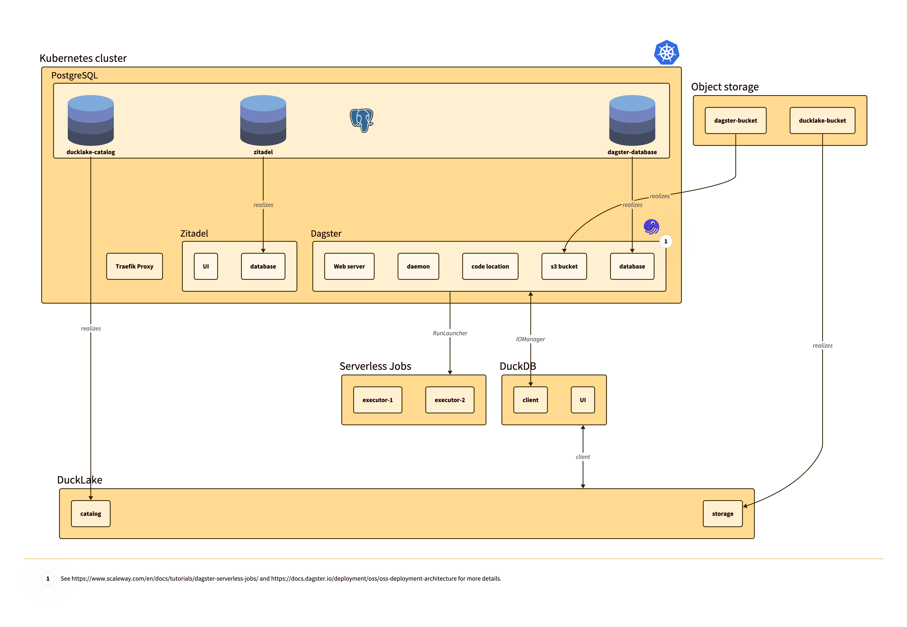

# 🚀 The Single Repo Data Platform (SRDP aka serendipity) 🚀
Because your data stack shouldn't require a PhD in Kubernetes and a second mortgage.

Welcome, weary data traveler. You've stumbled upon something serendipitous, a quixotic quest to build a sane, powerful, and actually usable data platform from the best open-source components we can find. All from the comfort of a single Git repository.[^1]

What's the big idea? To stop gluing together 87 different services with YAML, duct tape, and desperate Stack Overflow searches at 3 AM. We're assembling a dream team of data tools that play nicely together, so you can spend less time wrangling infrastructure and more time doing... well, whatever it is you data people do. Probably making fancy charts.📊

[^1]: We take inspiration from [Instant OpenHIE](https://openhie.github.io/instant/) project who have done the same for open source health information exchange platforms.
---

## The Dream Team: Our All-Star Roster
We didn't just pick these tools out of a hat. Okay, maybe a little. But mostly, we chose them because they're fast, modern, and don't make us want to throw our laptops out the window. Think of them as the Avengers of the data world, if the Avengers were less about smashing aliens and more about smashing GROUP BY queries.

Here's the lineup of our chosen champions:

| Component |	Role in the SRDP |	Our Unsolicited Opinion |
|:---|:---|:---|
|🛡️ Zitadel	|The Bouncer / Identity & Access Management	| Manages who gets to touch the precious data. Because "SELECT * FROM users;" should require more than just a password of password123. |
|🚦 Traefik	|The Traffic Cop / Cloud Native Proxy	| Directs all the incoming requests so services don't crash into each other. It's the only traffic jam you'll actually enjoy.|
|🐼 Polars	|The Speed Demon / Dataframe Library	| It's like pandas, but it actually uses all your CPU cores and doesn't take a coffee break on df.groupby(). Written in Rust, because of course it is.|
|🦆 DuckDB	|The Pocket Rocket / In-Process OLAP DB	| An incredibly fast analytical database that runs inside your application. It's the power of a warehouse in the body of a library. Quack-tastic!|
|👑 Dagster	|The Conductor / Data Orchestrator	| The sensible, type-aware adult in the room of chaotic data pipelines. It knows what your data assets are and helps you not set the whole factory on fire.|
|🚰 dlt-hub	|The Plumber / Data Loading Library	| Gets your data from "over there" to "right here" with surprisingly little fuss. Turns messy APIs into clean tables faster than you can say "ETL is dead".|
|🔧 dbt	    | The Transformer / Data Transformation Tool	| The "T" in ELT that everyone's talking about. It turns your analysts into data engineering heroes with the power of SELECT statements and Jinja.|
|📓 marimo	|The Mad Scientist's Notebook	| A next-gen reactive Python notebook. Change one cell, and the whole notebook updates. It's like magic, but with fewer rabbits and more legible code.|
|📜 Quarto	|The Storyteller / Scientific Publishing	| Turns your brilliant analysis into beautiful reports, presentations, and websites. Because data that isn't shared is just sad, lonely numbers.|

---

