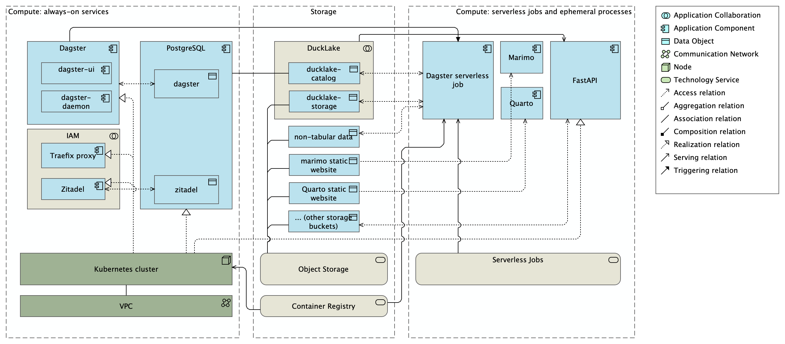

# Single Repo Data Platform (SRDP)

SRDP is a self-hostable data platform assembled from established open-source components and deployed from a single Git repository. It is aimed at teams that want a coherent, governable data stack without operating a large set of separately managed services. Combining a single-repository approach containing components known from homelab stacks and modern data platforms, SRDP is a serendipitous mix of best practices in one data platform. It is designed to be easy to deploy, easy to operate, and easy to extend.

The same logical architecture runs from a laptop (Docker Compose) to a single VM to a Kubernetes cluster, so development and production stay aligned.[^1]

[^1]: The single-repository approach takes inspiration from the [Instant OpenHIE](https://openhie.github.io/instant/) project, which packages an open-source health information exchange the same way.

## Components

| Component | Role in SRDP |
|:---|:---|
| [Zitadel](https://zitadel.com/) | Identity and access management. The single OIDC issuer; handles authentication and coarse project roles. |
| [Traefik](https://traefik.io/) | Reverse proxy and ingress. Terminates TLS, routes by hostname, and load-balances across services. |
| [OAuth2-Proxy](https://oauth2-proxy.github.io/oauth2-proxy/) | Edge authentication. Runs the OIDC login flow and gates protected services via Traefik forward-auth. |
| [DuckLake](https://ducklake.select/) / [DuckDB](https://duckdb.org/) | Lakehouse storage and the in-process analytical query engine. |
| [Dagster](https://dagster.io/) | Data orchestration. Asset-based pipelines with scheduling, retries, and lineage. |
| [dlt](https://dlthub.com/) | Data loading. Extracts data from external sources into the platform. |
| [dbt](https://www.getdbt.com/) | SQL-based data transformation. |
| [Polars](https://pola.rs/) | DataFrame library for in-process transformation in Python. |
| [marimo](https://marimo.io/) | Reactive Python notebooks for interactive analysis. |
| [Quarto](https://quarto.org/) | Reporting and publishing of analyses as static reports and sites. |

PostgreSQL backs the platform's stateful services (Zitadel and Dagster, and the DuckLake catalog).

## Architecture

See [Architecture & Conventions](03-architecture.md) for the service topology and the edge authentication model, and the [Architectural Decision Records](adr/index.md) for the design decisions behind the platform.
